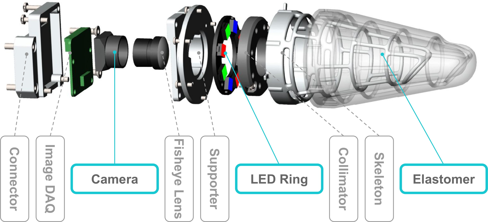

# Insight: A Haptic Sensor Powered by Vision and Machine Learning
<p align="right">
  *This is the only official content release regarding the design of Insight.*
</p>

This project shows the principle desing of [Insight](https://www.youtube.com/watch?v=lTAJwcZopAA&t=3s). It is a soft thumb-sized haptic sensor that can enbable robots feel directional force distributions all over a 3D conical surface.

The paper is titled "[A soft thumb-sized vision-based sensor with accurate all-round force perception](https://rdcu.be/cHCl9)", published at [*Nature Machine Intelligence*, 2022](https://rdcu.be/cHCl9). 

<p align="center">
  
This work was done by Huanbo Sun, Katherine J. Kuchenbecker, Georg Martius at the Max Planck Institute for Intelligent Systems.
  
If you make used of our work, please use the citation information [below](#Citation).
  
# Abstract
Vision-based haptic sensors have emerged as a promising approach to robotic touch due to affordable high-resolution cameras and successful computer vision techniques; however, their physical design and the information they provide do not yet meet the requirements of real applications. We present a robust, soft, low-cost, vision-based, thumb-sized three-dimensional haptic sensor named Insight, which continually provides a directional force-distribution map over its entire conical sensing surface. Constructed around an internal monocular camera, the sensor has only a single layer of elastomer over-moulded on a stiff frame to guarantee sensitivity, robustness and soft contact. Furthermore, Insight uniquely combines photometric stereo and structured light using a collimator to detect the three-dimensional deformation of its easily replaceable flexible outer shell. The force information is inferred by a deep neural network that maps images to the spatial distribution of three-dimensional contact force (normal and shear). Insight has an overall spatial resolution of 0.4 mm, a force magnitude accuracy of around 0.03 N and a force direction accuracy of around five degrees over a range of 0.03–2 N for numerous distinct contacts with varying contact area. The presented hardware and software design concepts can be transferred to a wide variety of robot parts.

# Working Mechanism
## Hardware Design
Insight is a vision-based haptic sensor that uses a camera and a structured lighting system to detect external contact happened on a soft hollow elastomer.
  
<p align="center">
  
## Software Design
Insight constantly records images from inside using a camera. Feeding these images and a reference image into a trained machine learning model makes it possible to estimate the force distribution all over a surface. Each pixel in the force prediction map has three values that indicate the force strength in three directions (x, y, and z). In a force visualization on the right, each point corresponding to each pixel in the force map shows the force distribution of the contact in both normal and shear directions.
  
  <p align="center">
    
# Key Components
Four key design components make Insight work properly: the mechanical design of its shell, the tailored imaging system inside, automatic data collection, and cutting-edge deep learning are used behind the scenes to create a cheap, robust, and high-fidelity device.
     
  <p align="center">
       
## Mechanics
Our hybrid structure of a soft elastomer shell enclosing a stiff metal skeleton ensures high sensitivity and robustness. The soft elastomer is for detecting light contact with high sensitivity. The metal skeleton is for holding the elastomer’s global shape and sustaining high-impact forces.

  <p align="center">

### Elastomer
- 3D Printer: [Formlabs Form 3](https://formlabs.com/eu/3d-printers/form-3/)
- 3D Printing Material: [Tough Resin FLTOTL05](https://formlabs.com/store/tough-2000-resin/). *Note: The material is updated.*
- Mold Design: 
  - [Mold 1](Solidworks/Elastomer_Mold1_In_Fingerprint_NailFlat.SLDPRT)
  - [Mold 2](Solidworks/Elastomer_Mold2_Out1.SLDPRT)
  - [Mold 3](Solidworks/Elastomer_Mold2_Out2.SLDPRT)
- Elastomer Material:
  - [EcoFlex 00-30](https://www.smooth-on.com/products/ecoflex-00-30/)
  - [Aluminum Powder 65 Micrometer, 99% Pure](https://www.amazon.de/Aluminumpulver-Aluminium-Pulver-Alupulver-Zus%C3%A4tze/dp/B06WRTGP2Y)
  - [Aluminum Flake 75 Micrometer](https://www.metallpulver24.de/de/aluminiumpulver-flaky-silber.html)
- [Vacuum Chamber VP1100, 5 Pa](https://www.silikonfabrik.de/vakuumtechnik/komplettsysteme/vakuum-komplettsystem-vks27/vp1200-vakuumkammer-und-pumpe.html). *Note: The Pump is updated.*
       
### Metal Skeleton
- 3D Printer: [ExOne X1 25 Pro](https://www.exone.com/en-US/Resources/News/X1-25PRO)
- 3D Printing Material: [AlSi10Mg-0403 Alluminum Alloy](https://www.shapeways.com/materials/aluminum) *Note: The material is updated.*
- Geometry Design: [Skeleton](Solidworks/Skeleton.SLDPRT)
- Printing Service: [Shapeways](https://www.shapeways.com/)
       
### Connector and Supporter
- 3D Printer: [ExOne X1 25 Pro](https://www.exone.com/en-US/Resources/News/X1-25PRO)
- 3D Printing Material: [AlSi10Mg-0403 Alluminum Alloy](https://www.shapeways.com/materials/aluminum) *Note: The material is updated.*
- Geometry Design: 
  - [Connector](Solidworks/Connector.SLDPRT)
  - [Supportor](Solidworks/Supporter.SLDPRT)
- Printing Service: [Shapeways](https://www.shapeways.com/)
      
## Imaging System
We use a LED ring and a collimator to create structured light. The structured light forms a light cone inside the enclosed volume. Each voxel inside this volume has a specific color code with 3D information. External contact moves the elastomer from one color zone to another. Together with shading effects the camera can detect 3D deformations of the surface from a single 2D image. As shown on the right figure, mimicking human fingerprint, we also add ridges to the surface to help the system recognize the directions of the surface extension.

  <p align="center">
    
### Camera
- [Maker Hawk Raspberry Pi Camera Module 8 MP (Raspberry Pi camera V.2.0)](https://www.amazon.co.uk/MakerHawk-Raspberry-Compatible-Supporting-Resolution/dp/B07HL3Q58Z)

### LED Ring
- [Neopixel Ring with eight pieces of WS2812 5050](https://www.amazon.de/gp/product/B019ZL6724/ref=ppx_yo_dt_b_asin_title_o05_s00?ie=UTF8&psc=1)       

### Collimator
- 3D Printer: [Formlabs Form 3](https://formlabs.com/eu/3d-printers/form-3/)
- Material: [Standard Black](https://formlabs.com/de/shop/black-resin/)
- Geometry Design: [Collimator](Solidworks/Collimator.SLDPRT)

### DAQ
- [Raspberry Pi 4 Model B](https://www.raspberrypi.com/products/raspberry-pi-4-model-b/) 
- [Python Code Runs in Raspberry Pi](Code/Python-Rasberry.md)

## Testbed
### Linear Guide
- [Linear Guide](https://www.barchmotion.com/)
   - [Linear Guide Geometry](Pics/BarchMotionGeometry.png)
   - [Linear Guide Order List](Pics/BarchMotionOrder.png)
- [Arduino for Testbed]
   - [Arduino Micro](https://store.arduino.cc/products/arduino-micro)
   - [Arduino Code](Code/Testbed-Arduino.md)
### Force/Torque Sensor     
       
# Software
## Data Collection
## Data Processing
       
# Citation
Please use the following citation if you make use of our work:
## BibTex
``` citation
@article{Insight,
  title = {A soft thumb-sized vision-based sensor with accurate all-round force perception},
  author = {Sun, Huanbo and Kuchenbecker, Katherine J. and Martius, Georg},
  journal = {Nature Machine Intelligence},
  volume = {4},
  organization = {Max Planck Institute for Intelligent Systems},
  month = feb,
  year = {2022},
  doi = {10.1038/s42256-021-00439-3},
  url = {https://rdcu.be/cHCl9},
  month_numeric = {2}
  } 
```
### RIS:
``` citation
TY  - JOUR
AU  - Sun, Huanbo
AU  - Kuchenbecker, Katherine J.
AU  - Martius, Georg
PY  - 2022
DA  - 2022/02/01
TI  - A soft thumb-sized vision-based sensor with accurate all-round force perception
JO  - Nature Machine Intelligence
SP  - 135
EP  - 145
VL  - 4
IS  - 2
SN  - 2522-5839
UR  - https://doi.org/10.1038/s42256-021-00439-3
DO  - 10.1038/s42256-021-00439-3
ID  - Sun2022   
```
       
       
       
 
       
    
